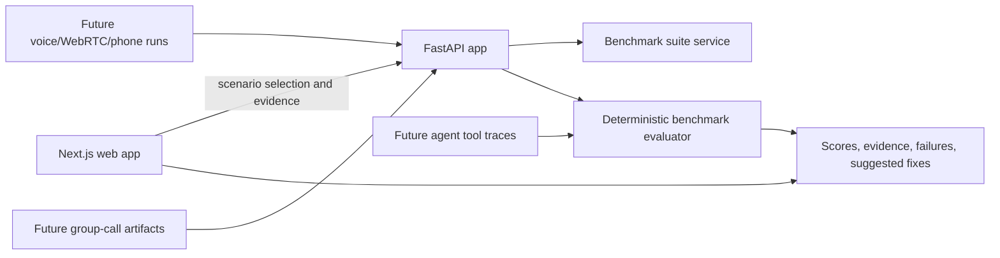

# ConversationAgentEvals

Benchmark conversation, voice, and group-call AI agents end to end, scoring task completion, tool actions, policy compliance, and final outcomes from real evidence.

## What this repo does

- Defines domain benchmark suites for consequential agent workflows.
- Runs scenario tests against conversation evidence: transcript, action/tool trace, and final observed state.
- Scores task completion, required actions, forbidden actions, policy constraints, final-state correctness, and evidence quality.
- Provides a focused benchmark runner UI at `/benchmarks`.
- Keeps the architecture ready for voice, WebRTC, phone, and group-call evaluation as the product expands.

## Product Direction

Most conversation eval tools grade tone or transcript quality. This project is aimed at a stricter question:

> Did the AI agent actually complete the job?

The MVP starts with text-first scenario simulation and deterministic scoring, then graduates the same benchmark shape to voice AI calls, group calls, tool execution, and vCon-compatible artifacts.

## Benchmark Families

- Call center voice AI: appointments, cancellations, transfers, interruptions, escalation.
- Telehealth intake: patient routing, privacy boundaries, medication and emergency handling.
- Online teaching: adaptive tutoring, quiz flow, confusion handling, grading boundaries.
- Fintech support: identity checks, disputes, card freezes, fraud escalation, compliance.

## Architecture



Core ownership:

- `apps/web`: Next.js SaaS homepage, benchmark runner, and presentation/demo surfaces.
- `apps/api`: FastAPI backend for sessions, evals, benchmark suites, simulation, and scoring.
- `apps/pipecat`: live media orchestration groundwork for voice/WebRTC paths.
- `docs`: product notes, implementation plan, and benchmark direction.

## Local Setup

```bash
cp .env.example .env
npm run setup
```

Then run the stack:

```bash
npm run dev
```

Or use Docker:

```bash
npm run docker:up
```

Default local endpoints:

- Web app: `http://localhost:3012` with Docker, or the URL printed by `npm run dev`
- API: `http://localhost:8025`
- Pipecat service: `http://localhost:8110`

## Useful Commands

```bash
npm run build:web
npm run test:api
npm run test:benchmark-smoke
npm run test:e2e
```

Voice proof against a running stack:

```bash
PLAYWRIGHT_BASE_URL=http://127.0.0.1:13000 \
PLAYWRIGHT_API_BASE_URL=http://127.0.0.1:8025 \
PLAYWRIGHT_PIPECAT_BASE_URL=http://127.0.0.1:8110 \
npm run test:voice-proof
```

## Current MVP Boundary

The current product surface is a SaaS homepage plus a focused benchmark runner. The runner can load benchmark suites, simulate a scenario with seeded edge cases and synthetic user turns, inspect transcript/action/final-state evidence, persist recent run history, show latest-vs-prior regression status and evidence diffs, export saved runs as vCon-compatible records, and produce a scored benchmark report.

Near-term next slices:

- Add prompt/model/version labels to each run for more useful regression comparisons.
- Add fuller multi-turn synthetic user and mock-agent simulation.
- Add voice/WebRTC call artifacts to the same benchmark schema.
- Add group-call evidence support: speakers, decisions, commitments, and follow-up actions.
- Expand vCon-compatible exports from simulated runs to imported voice workflows.
