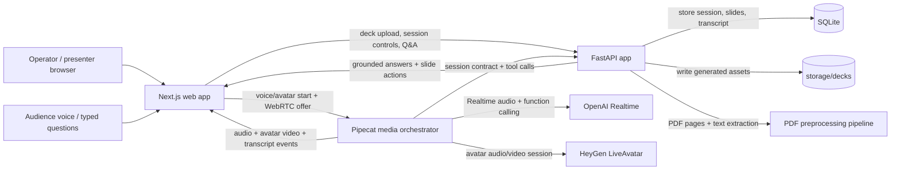

# LiveSalesAIPresenter

Demo-friendly local MVP for a slide-aware AI sales presenter with live voice and HeyGen avatar video.

## Demo

[](https://youtu.be/BDn-7vendds)

Watch the demo: [AI Video Avatar Sales Presenter Demo: Live Voice, Slides, and Q&A](https://youtu.be/BDn-7vendds)

Previous voice-only walkthrough: [AI Sales Presenter Demo: Voice-Controlled Slide Deck with Live Q&A](https://youtu.be/80qYz72yj9U)

## What this repo does
- Upload a PDF deck or use the built-in sample deck.
- Turn the PDF into slide images, extracted text, summaries, talk tracks, and Q&A context.
- Create a public presentation session with deterministic slide state.
- Serve a Next.js operator/presentation UI backed by FastAPI.
- Run a Pipecat/OpenAI Realtime voice path when `OPENAI_API_KEY` is configured.
- Render a HeyGen LiveAvatar video avatar through Pipecat `HeyGenVideoService` on the existing simple WebRTC path when `HEYGEN_LIVE_AVATAR_API_KEY` and `HEYGEN_AVATAR_ID` are configured.
- Keep slide navigation, transcript, and Q&A grounded in the FastAPI session state.

## High-level architecture



Core ownership:
- **Next.js (`apps/web`)**: operator UI, public presentation page, controls, voice connection client.
- **FastAPI (`apps/api`)**: source of truth for decks, sessions, transcript, grounded Q&A, and slide tools.
- **Pipecat (`apps/pipecat`)**: live media orchestration, WebRTC audio/video handshake, OpenAI Realtime integration, HeyGen LiveAvatar video service, and tool execution against FastAPI.
- **SQLite + `storage/decks`**: local dev persistence and generated deck assets.

## Preferred run path: Docker

This repo should be run through Docker Compose by default.

### First time only
```bash
cp .env.example .env
npm run setup
```

Notes:
- `.env` is local-only and must never be committed or pushed.
- `setup` prefers `python3.13` automatically when available, which avoids current `pydantic-core` build issues on Python 3.14.

### Start the stack
```bash
npm run docker:up
```

### Stop the stack
```bash
npm run docker:down
```

Canonical local endpoints:
- Web app: `http://localhost:3012`
- API: `http://localhost:8025`
- Pipecat voice/avatar service: `http://localhost:8110`

Use the Docker stack as the source of truth for routine development, validation, and demos.

## Secondary local path: host dev launcher

Use this only when intentionally debugging outside Docker or when working on a targeted inner loop.

```bash
npm run dev
```

That starts the API, Pipecat voice service, and web app together on host processes. If a preferred port is busy, the launcher selects the next free port and prints the exact URLs to use.

## 2-minute operator flow
1. Start the stack with `npm run dev` or `npm run docker:up`.
2. Open the web URL printed by `npm run dev`, or `http://localhost:3012` for Docker.
3. Click **Use default attached deck** or upload a PDF.
4. Wait for preprocessing to finish and skim the slide preview.
5. Click **Create live demo session**.
6. Open the generated presentation link.
7. Click **Start** and run the deck with the controls.
8. Use text Q&A, simulated voice questions, or live voice/avatar when Pipecat, OpenAI Realtime, and HeyGen are configured.

## Project layout
- `apps/web`: Next.js operator and presentation UI.
- `apps/api`: FastAPI backend for deck ingestion, sessions, grounding, transcript, and slide assets.
- `apps/pipecat`: media orchestrator for Pipecat/OpenAI Realtime plus HeyGen LiveAvatar video, `/ask`, and WebRTC transport proof.
- `storage/decks`: local generated deck files.

## Verification

Run this validation sequence before calling meaningful changes done.

### 1) API unit tests
```bash
npm run test:api
```

### 2) Web production build
```bash
npm run build:web
```

### 3) Voice-only proof against the real running stack
Replace the ports with the exact URLs printed by `npm run dev` if the launcher picked alternates:
```bash
PLAYWRIGHT_BASE_URL=http://127.0.0.1:13000 \
PLAYWRIGHT_API_BASE_URL=http://127.0.0.1:8025 \
PLAYWRIGHT_PIPECAT_BASE_URL=http://127.0.0.1:8110 \
npm run test:voice-proof
```

This proves the default-deck/session path, Pipecat bootstrap, transcript-driven `/ask` loop, current-slide answer, one slide-navigation tool call, one grounded deck answer, SDP answer, ICE exchange, and remote browser audio receiver. When HeyGen is configured, the live WebRTC path also negotiates a remote avatar video track.

### 4) Broader E2E against the real running stack
For the Docker path:
```bash
PLAYWRIGHT_BASE_URL=http://127.0.0.1:3012 PLAYWRIGHT_REUSE_EXISTING_SERVER=1 npm run test:e2e
```

For the host `npm run dev` path, point Playwright at the exact printed web URL instead of assuming `3000`.

Note: the build script intentionally clears `apps/web/.next` first. That avoids stale Next cache/runtime state that can otherwise surface as missing `vendor-chunks/next.js` or other stale server bundle errors on `/present/[token]`.

## Development process
1. Read this README first.
2. Check `git status`.
3. Prefer Docker for running services.
4. Implement cleanly and update docs with workflow changes.
5. Run relevant tests/builds.
6. Keep `.env`, DBs, caches, generated deck storage, and secrets out of git/GitHub.

## Current MVP boundaries
- The active finish line is the proven voice/session loop plus a server-orchestrated HeyGen video avatar surface using Pipecat `HeyGenVideoService`; the old GPT realtime orb visualization has been replaced by avatar video on the existing simple WebRTC stream.
- Pipecat owns the voice/avatar path: `/bootstrap`, `/live/create`, `/live/join`, `/live/ice`, `/ask`, and slide/navigation tools.
- Text Q&A and simulated voice are available for non-live proof; live voice requires Pipecat plus OpenAI Realtime credentials; avatar video additionally requires HeyGen credentials.
- Set `PRODUCTION=true` to hide non-live testing controls such as text Q&A and simulated voice in the presentation UI. Leave it false/empty for local proof and demo validation.
- `text-embedding-3-small` support is currently a placeholder: the API client has an embedding helper and slides have an `embedding_ref` field, but embeddings are not generated or used yet. The intended use is semantic slide retrieval during preprocessing/Q&A, so questions can match related slide meaning even when keywords differ.
- Best demo experience is still with relatively small PDF decks.
