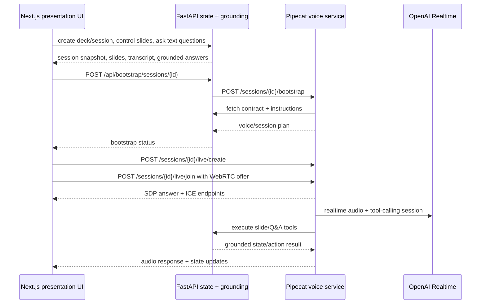

# Pipecat live voice contract

This doc captures the current voice-only direction for the MVP.

## Goal
Make Pipecat the live voice orchestrator while FastAPI remains the source of truth for deck/session state.

The live path should:
- load prompt/instructions from FastAPI
- use the FastAPI tool manifest for slide state, search, navigation, pause/resume, and grounded Q&A
- expose a stable Pipecat agent/session contract to the web app
- use WebRTC for browser media transport
- keep `/sessions/{id}/ask` as a transcript-injection test/dev harness

## Current architecture

## Runtime contracts

### FastAPI owns
- deck metadata and generated slide assets
- presentation session status/current slide/autoplay
- transcript and live events
- grounded Q&A
- tool endpoints for current slide, search, navigation, pause/resume, and slide content

### Pipecat owns
- live voice session lifecycle
- browser WebRTC offer/answer/ICE handling
- OpenAI Realtime session config
- realtime tool dispatch into FastAPI
- transcript-injection `/ask` harness for automated proof

### Web owns
- operator and presentation UI
- slide controls
- text Q&A and simulated voice harness
- live voice start/stop and WebRTC client connection

## Key endpoints

FastAPI:
- `POST /api/bootstrap/sessions/{session_id}`
- `GET /api/realtime/sessions/{session_id}/contract`
- `GET /api/realtime/sessions/{session_id}/instructions`
- `POST /api/sessions/{session_id}/ask`
- slide tool endpoints under `/api/sessions/{session_id}/...`

Pipecat:
- `POST /sessions/{session_id}/bootstrap`
- `POST /sessions/{session_id}/agent/start`
- `GET /sessions/{session_id}/agent/state`
- `POST /sessions/{session_id}/agent/stop`
- `POST /sessions/{session_id}/live/create`
- `POST /sessions/{session_id}/live/join`
- `POST /sessions/{session_id}/live/ice`
- `POST /sessions/{session_id}/ask` for transcript-injection tests/dev proof

## Validation gates
- `npm run test:api`
- `npm run lint:web`
- `npm run build:web`
- `npm run test:voice-proof` against a running stack

## Current MVP boundaries
- Voice-only branch: no avatar vendor, no browser avatar SDK.
- Live voice requires Pipecat plus OpenAI Realtime credentials.
- Text Q&A and simulated voice remain useful for non-live proof and regression testing.
- The automated media proof validates SDP answer, ICE exchange, and remote audio receiver; full spoken-audio automation is a later slice.
